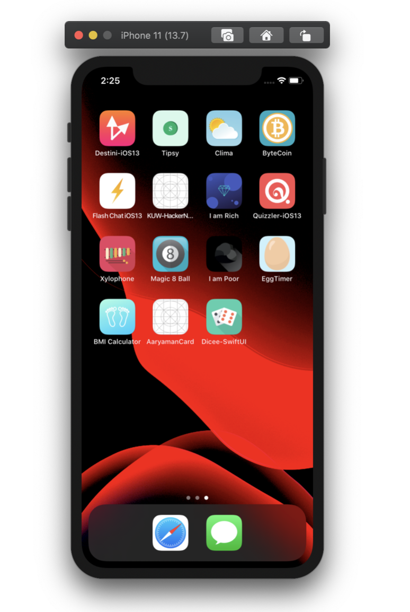

# My-iOS-Shortcut

## Design Patterns
### [MVC](https://github.com/saini1998/MVC_DesignPattern)
### [MVP](https://github.com/saini1998/MVP)
### [Dependency Injection](https://github.com/saini1998/DependencyInjection)

## iOS/Swift Concepts and Apps (recent ones first)
### [Global Actors](https://github.com/saini1998/SwiftConcepts/tree/main/GlobalActors.playground)
### [Hashable and Equatable](https://github.com/saini1998/hashableEquatable)
### [Retain Cycles and Instrument Profiler](https://github.com/saini1998/RetainCycleInstrumentProfiler)
### [Key Chain Implementation](https://github.com/saini1998/Keychain)
### [Conscious Glasses](https://github.com/saini1998/ConsciousGlassesApp)
### [Calnewlator](https://github.com/saini1998/Calnewlator)
### [Pharmagy](https://github.com/saini1998/pharmagyApp)
### [Calory Inatakes](https://github.com/saini1998/CaloryIntakeApp)
### [Photos Picker](https://github.com/saini1998/PhotoPickerApp)
### [Gradient Buttons](https://github.com/saini1998/GradientButtonsApp)
### [Trivia AR](https://github.com/saini1998/TriviaAR)
### [Dine AR](https://github.com/saini1998/DineAR)
### [WorkIt](https://github.com/saini1998/WorkIt)
### InspoQuotes
### [ToDo List](https://github.com/saini1998/ToDo_List_App)
### [Hacker News](https://github.com/saini1998/HackerNews-App)
### Flashchat
### [Clima](https://github.com/saini1998/HowsTheWeather-App)
### [Tipsy](https://github.com/saini1998/Cal_Tip_App)
### [BitCoin](https://github.com/saini1998/ByteCoin-App)
### [MakeYourStory](https://github.com/saini1998/MakeYourStory)

## More coming soon!

